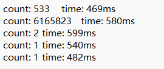

代码设计如下：

# 1、内存映射文件类

用于将1g的大xml文件直接映射到内存中，节省io时间。

# 2、KMP搜索和单个线程任务

使用KMP算法来进行字符串匹配，单个线程负责大文件切分后的某个块，搜索这个块中各个关键词出现的次数。由于没有对单一的关键词创建单独的线程，因此统计时间使用的是该关键词最早开始搜索的时间和最晚结束搜索的时间之差作为该关键词搜索任务的持续时间。相较于将单个关键词作为一个线程的作法，该方法统计下每个关键词的时间可能更长，但总执行时间不会有太大出入，并且在关键词较多的情况下不会生成太多的线程。

# 3、创建线程

将大文件切分成线程数量个，每个线程负责进行所有关键词与某一块数据的字符串匹配。

# 4、输出结果

多个关键词一起搜索时输出结果如下：

可以看到时间都差不多。

如果分别单个搜索关键词：

